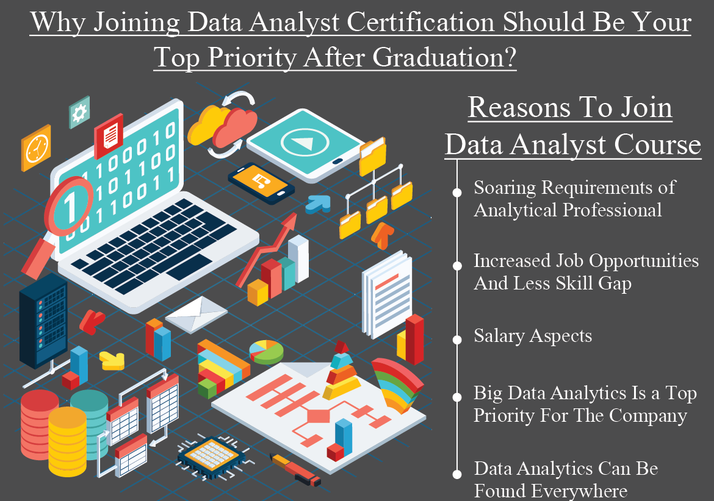

# **Careers in Computer Science: Data Analyst**

#### **Avin Ahmadi - Course: ICS4U**
 

## **The Basics**

*****
 

### <ins> Job Description: </ins>

A data analyst collects and stores data on company statistics. Using technical tools and analytical thinking, they process data according to the need of the institution they are working for to help them make better decisions for their business. (BetterTeam) Different types of data analysts are medical and health care, market research, business intelligence, operations research, and intelligence analysts. (Simplilearn)

 

### <ins> Responsibilities: </ins>

#### According to Simplilearn, data analysts are responsible for:

- Using automated tools to extract data from primary and secondary sources
- Removing corrupted data and fixing coding errors and related problems
- Developing and maintaining databases, data systems – reorganizing data in a readable format 
- Performing analysis to assess quality and meaning of data
- Filter Data by reviewing reports and performance indicators to identify and correct code problems
- Using statistical tools to identify, analyze, and interpret patterns and trends in complex data sets that could be helpful for the diagnosis and prediction
- Assigning numerical value to essential business functions so that business performance can be assessed and compared over periods of time.
- Analyzing local, national, and global trends that impact both the organization and the industry
- Preparing reports for the management stating trends, patterns, and predictions using relevant data
- Working with programmers, engineers, and management heads to identify process improvement opportunities, propose system modifications, and devise data governance strategies. 
- Preparing final analysis reports for the stakeholders to understand the data-analysis steps, enabling them to take important decisions based on various facts and trends. 
(Simplilearn)

  

### <ins> Required Education: </ins>

#### A bachelor's degree, preferably in computer science in mathematics, statistics, or computer science is usually a requirement. Sometimes completion of a College program is also accepted by recruitment teams. Computer programming experience with languages such as Python, R, and SQL is often required as well. (Government of Canada)
#### Since the technology field continues to grow every day, additional experience and certifications can be beneficial for job search purposes and winning resumes. These certificates are offered in a variety; from introductory data analytics courses to specialized programs in machine learning and Python all the way up to MBA programs with a data analytics focus. (Morales)

 

### <ins> Technical and Non-technical Skills: </ins>

* Technical Skills:
    1. Data cleaning and preparation
    2. Data analysis and exploration
    3. Statistical knowledge
    4. Creating data visualizations
    5. Creating dashboards and reports
    6. Domain knowledge
* Non-technical Skills:
    1. Writing and communication
    2. Problem solving (Grupman)
 

## **Standard Education**

*****
 

### <ins> [Program: Computer Science I at McMaster University](https://www.eng.mcmaster.ca/computer-science-1) </ins>

####
+ Degree: Bachelor of Applied Science, BASc
+ Degree Duration: 4 years
+ Experiential Learning: Co-op or internship application available at the university after registration
+ Enrollment: 180 (total for OUAC codes MC and MCC)
+ Grade Range: A minimum of 90% is required for consideration. Admission is by selection.
+ Entrance Requirements:
    + ENG4U
     + MCV4U
     + Two of: SBI4U, SCH4U, SPH4U, SES4U, ICS4U, TEJ4M
     + Supplementary Application to be completed
+ First Year Courses:
    + Introduction to Computational Thinking
    + Introduction to Programming
    + Practice and Experience: Development Basics
    + Practice and Experience: Intro to Software Design Using Web Programming
    + Discrete Math for Comp Sci
    + 3 courses in calculus and linear algebra
    + 2 open electives
+ Degree Completion Requirements:
    + 24 required units + 6 elective units for the first year
    + In this program, 30 units can be taken as open elective courses, meaning you can easily complete a minor alongside your degree.
    + Eighteen units of technical electives must be taken in upper years and can be fulfilled with courses such as Machine Learning or Software Entrepreneurship.
    + Computer science students complete a Capstone Project course to capoff their experiential learning in their final year
(McMaster University; Ontario Universities Info)
 
 
| McMaster University        |  Computer Science I
| :-------------------------:|:-------------------------:
|    |  

## **Real Jobs**

*****
 

### <ins> *Entry-Level Position* </ins>
##### **_To visit the actual job posting, click [here](https://workopolis.com/jobsearch/find-jobs?ak=data+analyst+entry+level&l=&job=ih2U66a6Vl2ELYpfpJ3taV-hfgWn5xHnPGnH07PjVkBArpdzT3SVow)_**

| Job Title: Failure Analyst     |  
| -------------------------------|-------------------------
| Salary                         |  $47,000-$59,000 a year
| City                           |  Victoria, BC
| Job Description                |  <ins> **Description** </ins>   The Plant Quality Team is looking for an enthusiastic and motivated Failure Analyst to play a role in the analysis of failures, whether a component or product failed in the field, or a failure occurred during the production/test process.   He/She would make recommendations for product improvements and process changes based on your expertise, as well manage and coordinate all incoming product changes in the plant.   This position will include a high level of interaction with other groups such as Production, Manufacturing Engineering, Design and Continuous Engineering, Offer Quality, and Technical Support.   <ins> **Main responsibilities** </ins>   - Collect and analyze data to determine the cause of a failure for units returned from the field or in the production process and ensure accurate failure data is entered into the appropriate database for trending.   - Operate various test and measurement equipment to troubleshoot and isolate faults.   - Conduct customer requested failure analysis investigations and generate appropriate technical reports.   - Provide support and expertise when necessary for customer complaints and provide technical guidance and be an onsite resource for production   - Drive improvements based on findings, using appropriate tools like FMEA, PCP, etc.   - Work with Design Engineering to coordinate and manage product changes in the plant
| Additional Skills/Experience   |  + Have an Electrical Engineering (or equivalent) degree.   + 1-2 years of experience - Fresh graduates are welcome to apply   + Good project management and problem solving skills.   + Have knowledge of electronic circuits both analog and digital   + Customer focused and have the ability to communicate sensitive product failure information effectively.   + Have good written and verbal communication, ability to prepare complex written reports, business correspondence, and work instructions. (Workopolis)

 

### <ins> *Average-Level Position* </ins>
##### **_To visit the actual job posting, click [here](https://ca.indeed.com/jobs?q=dawn+infotek&l=Toronto%2C+ON&vjk=28950535cae2dc2c)_**

| Job Title: Data Analyst (Banking)   | 
| ------------------------------------|-------------------------
| Salary                              |  $60-$80 an hour
| City                                |  Toronto, ON
| Job Description                     |  <ins> **Description** </ins>   Dawn InfoTek Inc. is a professional IT consulting team that partners with major financial institutions, investment firms and government sectors. We have been dedicated to delivering cutting-edge consulting services and recruiting all levels of IT positions for our clients.   We are currently seeking competent individuals to fulfill the role of **Data Analyst** to join our dynamic team for our client, one of the major banks.   <ins> **Responsibilities** </ins>   - Work with senior team members (architects, developers, testers) to develop and implement data solutions for finance reporting systems   - Turn business requirements into data model and generate source to target mapping and other technical documentation (data transformations, design and operational support documentation)   - Analyze data in both Financial Systems and Big Data environments.   - Support senior team members through research assignments and proof of concepts   - Demonstrate a passion for problem solving and data presentation technologies   - Pursue enterprise learning opportunities to develop and mature your skills in the big data space   <ins> **Requirements** </ins>   - At least 3+ years’ experience developing and deploying complex technology   - Data Modeling experience with Agile methodology and familiar with scrum meetings and sprint planning.  - Understand data modeling, metadata knowledge for both structured and non-structured data; familiarity with ER model diagrams and business metadata; familiarity with identification of the data entities, application of the data normalization rules, definition of the primary keys and determination of the data elements relationship.   - Proficiency with ACL/SQL tools for data analysis, data mining, source target mapping, data domain and referential integrity verifications.
| Additional Skills/Experience        |  + developing and deploying complex technology: 1 year (required)   + Agile methodology: 1 year (required)   + data modeling and meta data knowledge: 1 year (preferred)   + ACL/SQL tools for data analysis, data mining: 1 year (preferred) (Indeed)

 

### <ins> *Senior-Level Position* </ins>
##### **_To visit the actual job posting, click [here](https://ca.indeed.com/jobs?q=business+intelligence+developer&l=Toronto%2C+ON&vjk=d3dd1930402800ef)_**

| Job Title: Business Intelligence Developer| 
| ------------------------------------------|-------------------------
| Salary                                    |  $75-$85 an hour
| City                                      |  Toronto, ON
| Job Description                           |  <ins> **Responsibilities** </ins>   - Generate actionable insights from data and produce analysis and reporting to support business needs.   - Work closely with partners from various functions to understand business objectives and context, translate business requirements to technical specifications, design and execute data solutions.   <ins> **Essential skills** </ins>   - Proficient and extensive hands-on experience in SQL, Tableau and Python.   - Experience in big data tools such as Hadoop and Hive.   - 5+ years relevant work experience.   - Strong communication, relationship management and project management skills.   <ins> **Skills considered assets** </ins>   - Knowledge in banking and finance products.   - Master's degree in quantitative discipline, finance or business.   - Pyspark.   - Experience in Azure cloud environment.
| Additional Skills/Experience              |  **Must Have:**   1- SQL – 5+ years   2- Tableau – 3 years   3- Hadoop or Hive experience – 3 years   4- Python – 3 years   5- Strong communication skills     **Nice to Have:**   1- banking experience   2- TD experience   3- Cloud and Pyspark (Indeed)

 

### <ins> Salary Range: </ins>
#### According to Talent, the average salary of a data analyst in Canada is $68,695 per year, in other words, expressed as $35.23 per hour. Entry-level positions start at as low as $53,054 per year, while most experienced professionals can make up to $94,729 per year. (Talent)
 
  

| RANGE: $53,054-$94,729 per year     |  &nbsp;
| ------------------------------------|-------------------------
||  

## **Experiential Learning**

*****
 

#### As the data industry is booming in 2022, there are all sorts of ways through which people interested in data analysis can gain experience. These include but are not limited to self-started projects or courses, co-op programs, internship offers, workshops, contests, competitions, or even upping their game in non-technical skills such as project management or leadership skills. Since the data market has been brought to the attention of many, varieties of opportunities are being offered in each of the branches mentioned above. To name a few, based on CareerFoundry, some of the top project-based data analysis courses are:
- [CareerFoundry Data Analytics Program](https://careerfoundry.com/en/courses/become-a-data-analyst/)
- [Springboard Data Analytics Career Track ](https://www.springboard.com/courses/data-analytics-career-track/)
- [Cloudera Data Analyst Certification](https://www.cloudera.com/about/training/courses/data-analyst-training.html?course=data-analyst&loc=online)
- [BrainStation Data Analytics Certificate](https://brainstation.io/course/online/data-analytics?utm_keyword=data%20analytics%20courses&utm_network=g&utm_matchtype=e&utm_creative=414479179100&utm_target=&utm_placement=&utm_device=c&utm_campaign=7718470978&utm_adgroup=92515064375&utm_source=AdWords&gclid=EAIaIQobChMIpZSJsIPU6AIVx7HtCh1xhQHZEAAYAiAAEgIjAvD_BwE)
- [Harvard University Business Analytics Course](https://pll.harvard.edu/course/business-analytics?delta=0)
- [Thinkful Data Analytics Immersion Course](https://www.thinkful.com/bootcamp/data-analytics/)
- [General Assembly Data Analytics Course](https://generalassemb.ly/education/data-analytics-remote-online)
- [MIT Sloan School of Management Applied Business Analytics Certificate](https://executive-ed.mit.edu/applied-business-analytics?utm_campaign=B-365D_EU_GG_SE_ABA_Generic_ALWON&utm_content=Data_Analytics&utm_medium=c&utm_source=Google&utm_term=%2Bdata+%2Banalytics+%2Bcertification)
#### As of October 10, 2022, some other opportunities that future or current data analysts can take advantage of are:
- [Introductory courses for aspiring data analysts on databricks.com (databricks)](https://www.databricks.com/discover/introduction-to-data-analysis-workshop-series)
- [Internship and co-op offer at Appficiency Inc. as a Digital Performance Marketing Analyst - Mississauga, ON (Indeed)](https://ca.indeed.com/Data-Analyst-Shadowing-jobs-in-Toronto,-ON?vjk=7eb173f2b82d05ee)
- [Data Analyst Co-op offer by OpenCare for 2023 - Toronto, ON (OpenCare)](https://jobs.lever.co/opencare/71d7a995-c4f8-46cc-9462-3333ba6add00)
- Yearly data analysis competitions designed and offered by communities such as:
    - Kaggle
    - Codalab
    - AIcrowd
    - Bitgrit
    - CrowdANALYTIX
    - DrivenData
    - InnoCentive
    (Adams)
     *To learn more about competitions around data analysis, click [here.](https://medium.com/codex/top-data-science-competitions-to-watch-out-for-in-2022-4d8dcf062d6a)*
#### Moreover, ideas below provide chances for every person to improve their non-technical skills:
- [Earning the PMP global certificate of project management, giving room to become better with people, process, and business environments (Project Management Institute)](https://www.pmi.org/certifications/project-management-pmp) 
- [Participating in the Exercising Leadership: Foundational Principles course, offered by Harvard University through edX (edX)](https://www.edx.org/course/exercising-leadership-foundational-principles)
- Beginning to do more self-induced research, analysis, and evaluation on topics that interest you to engage your critical thinking (UniLodge)

   For more suggestions on improving non-technical skills, [check this out.](https://www.unilodge.com.au/blog/how-to-develop-critical-thinking)

  

 

### 
 **Works Cited** 

 

Adams, Lucia. “Top Data Science competitions to watch out for in 2022.” *Medium*, 6 April 2022, https://medium.com/codex/top-data-science-competitions-to-watch-out-for-in-2022-4d8dcf062d6a. Accessed 10 October 2022.   
BetterTeam. “Data Analyst Job Description.” *Betterteam*, 2 December 2020, https://www.betterteam.com/data-analyst-job-description. Accessed 10 October 2022.   
databricks. “Introduction to Data Analysis Workshop Series – Databricks.” *Databricks*, 24 August 2020, https://www.databricks.com/discover/introduction-to-data-analysis-workshop-series. Accessed 10 October 2022.   
edX. “Exercising Leadership: Foundational Principles.” *edX*, N/A, https://www.edx.org/course/exercising-leadership-foundational-principles. Accessed 10 October 2022.   
Government of Canada. “Database Analyst in Canada | Job requirements.” *Job Bank*, 16 August 2022, https://www.jobbank.gc.ca/marketreport/requirements/17873/ca;jsessionid=487BC08556438E73C1AE2FB4A781F8FB.jobsearch75. Accessed 10 October 2022.   
Grupman, Celeste. “8 Data Analyst Skills Employers Need to See in 2022.” *Dataquest*, 27 June 2022, https://www.dataquest.io/blog/data-analyst-skills/. Accessed 10 October 2022.   
Indeed. “Data Analyst Co-op search.” *Indeed*, 2022, https://ca.indeed.com/Data-Analyst-Shadowing-jobs-in-Toronto,-ON?vjk=7eb173f2b82d05ee. Accessed 10 October 2022.   
Indeed. “Data Analyst Job Positions.” *Indeed*, 2022, https://ca.indeed.com/jobs?q=data+analyst&l=Toronto%2C+ON&from=searchOnHP&vjk=fe7268347d0b46fc. Accessed 10 October 2022.   
McMaster University. “Computer Science 1 | Faculty of Engineering.” *McMaster Engineering*, N/A, https://www.eng.mcmaster.ca/computer-science-1#About-CS1. Accessed 10 October 2022.  
Morales, Steve. “How to Become a Data Analyst.” *CourseCompare*, 27 July 2022, https://www.coursecompare.ca/how-to-become-a-data-analyst/. Accessed 20 October 2022.   
Ontario Universities Info. “Computer Science I – OUInfo.” *Ontario Universities' Info*, N/A, https://www.ontariouniversitiesinfo.ca/programs/1251. Accessed 10 October 2022.   
OpenCare. “Opencare - Data Analyst Co-op (2023).” *Lever*, N/A, https://jobs.lever.co/opencare/71d7a995-c4f8-46cc-9462-3333ba6add00. Accessed 10 October 2022.   
Project Management Institute. “Apply for PMP Certification.” *PMI*, N/A, https://www.pmi.org/certifications/project-management-pmp. Accessed 10 October 2022.   
Simplilearn. “Job Description for Data Analyst: Responsibilities and Skills Required.” *Simplilearn*, 30 September 2022, https://www.simplilearn.com/data-analyst-job-description-article. Accessed 10 October 2022.   
STEVENS, EMILY. “The 9 Best Data Analytics Certification Programs of 2022.” *CareerFoundry*, 21 September 2022, https://careerfoundry.com/en/blog/data-analytics/best-data-analytics-certification-programs/. Accessed 10 October 2022.   
Talent. “Data Analyst Salary in Canada - Average Salary.” *Talent.com*, 2022, https://ca.talent.com/salary?job=data+analyst. Accessed 10 October 2022.   
UniLodge. “How to Develop Critical Thinking.” *UniLodge*, 11 September 2019, https://www.unilodge.com.au/blog/how-to-develop-critical-thinking. Accessed 10 October 2022.   
Workopolis. “Data Analyst Job Positions.” *Workopolis*, 2022, https://workopolis.com/jobsearch/find-jobs?ak=data+analyst+entry+level&l=&job=ih2U66a6Vl2ELYpfpJ3taV-hfgWn5xHnPGnH07PjVkBArpdzT3SVow. Accessed 10 October 2022.   

*****

### 
 **Images Cited** 

 
Danske Bank. *People Looking at Laptops*. 31 January, 2020. *Danske Bank*, https://job.danskebank.lt/data-analyst-in-transaction-services-2/    
FlatWorld Solutions. *Man Holding Data*. 11 June, 2020. *FlatWorld Solutions*, https://blog.flatworldsolutions.com/why-is-failure-analysis-important/   
GeeksForGeeks. Minimal *Man and Woman Discussing*. 30 September, 2019. *GeeksForGeeks*, https://www.geeksforgeeks.org/how-to-become-a-data-analyst-in-2019-a-complete-guide/   
GrantMe. *McMaster University Entrance Sign*. 12 May, 2022. *GrantMe*, https://grantme.ca/blog-mcmaster-computer-science/   
ITPro Today. *Man Hands Typing*. 23 September, 2022. *ITPro Today*, https://www.itprotoday.com/salary-survey   
Learn SQL. *Man Tossing Money Around*. 27 August, 2021. *Learn SQL*, https://learnsql.com/blog/how-much-do-data-analysts-earn/   
LSU Online. *Woman Working on Data*. N/A. *LSU Online*, https://online.lsu.edu/newsroom/articles/how-to-become-data-analys/   
McMaster University. *Man Focusing on Data*. 15 September, 2022. *McMaster University*, https://continuing.mcmaster.ca/programs/tech-data/big-data-programming-and-architecture/   
SLA Consultants India. *Why joining Data Analyst certification should be your top priority after Graduation?*. 24 October, 2018. *SLA Consultants India*, https://www.slaconsultantsindia.com/why-joining-data-analyst-certification-should-be-your-top-priority-after-graduation/   
University of San Diego. *Your Career Guide to This In-Demand, Data-Driven Field*. 28 September, 2021. *University of San Diego Online*, https://onlinedegrees.sandiego.edu/business-intelligence-analyst-career/   